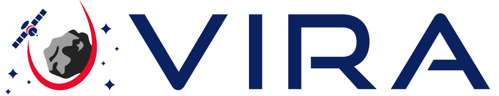

# 

Named after Viracocha (the Inca creator deity and creator of the Scene, sun, moon, and stars), Vira is a rendering and ray tracing library for space exploration and mission design purposes.

This project provides a library which can be used for building new projects, as well as several executables to provide specific functionality.

In the future, we hope to consolidate these executables into a single comprehensive application, as well as to provide bindings for Python, Julia, and MATLAB.

## Repository File Structure
- `cmake/`: CMake helper modules
- `dependencies/`: Folder containing dependency lists and environment configurations
- `docs/`: Documentation source files
- `examples/`: Example code demonstrating how to use the API
- `include/vira/`: Public interface for the vira library (`.hpp`)
- `scratch/`: Empty directory where you can put your own scratch scripts to be compiled alongside Vira.
- `scripts/`: Scripts (`.bat` and `.sh`) for downloading exmaple data
- `source/`: Source code for the vira library and executables (`.cpp`), and private headers (`.hpp`), as well as GLSL Shader code for the future Vulkan implementation
- `tests/`: Source code for tests (`.cpp`) *Coming Soon*

# Building Vira
Please refer to the platform specific build instructions:
- **[Windows](docs/build_instructions/windows.md)**
- **[Windows (Visual Studio)](docs/build_instructions/visual_studio.md)** (for developers)
- **[Linux](docs/build_instructions/linux.md)**
- **[MacOS](docs/build_instructions/macos.md)**

For the options on how to configure the project, please see the [configurations](docs/build_instructions/configurations.md) overview.  This includes building python bindings and documentation.

# License
Vira is licensed under the NASA Open Source Agreement (NOSA) ([LICENSE](./LICENSE.pdf))

# Acknowledgements
Vira was developed in large part to support the LuNaMaps project, which was originally led by Carolina Restrepo.  Without her encouragement and support, Vira likely would not exist in the state it does today.

# Disclaimers
No Warranty: THE SUBJECT SOFTWARE IS PROVIDED "AS IS" WITHOUT ANY WARRANTY OF ANY KIND, EITHER EXPRESSED, IMPLIED, OR STATUTORY, INCLUDING, BUT NOT LIMITED TO, ANY WARRANTY THAT THE SUBJECT SOFTWARE WILL CONFORM TO SPECIFICATIONS, ANY IMPLIED WARRANTIES OF MERCHANTABILITY, FITNESS FOR A PARTICULAR PURPOSE, OR FREEDOM FROM INFRINGEMENT, ANY WARRANTY THAT THE SUBJECT SOFTWARE WILL BE ERROR FREE, OR ANY WARRANTY THAT DOCUMENTATION, IF PROVIDED, WILL CONFORM TO THE SUBJECT SOFTWARE. THIS AGREEMENT DOES NOT, IN ANY MANNER, CONSTITUTE AN ENDORSEMENT BY GOVERNMENT AGENCY OR ANY PRIOR RECIPIENT OF ANY RESULTS, RESULTING DESIGNS, HARDWARE, SOFTWARE PRODUCTS OR ANY OTHER APPLICATIONS RESULTING FROM USE OF THE SUBJECT SOFTWARE.  FURTHER, GOVERNMENT AGENCY DISCLAIMS ALL WARRANTIES AND LIABILITIES REGARDING THIRD-PARTY SOFTWARE, IF PRESENT IN THE ORIGINAL SOFTWARE, AND DISTRIBUTES IT "AS IS."

Waiver and Indemnity:  RECIPIENT AGREES TO WAIVE ANY AND ALL CLAIMS AGAINST THE UNITED STATES GOVERNMENT, ITS CONTRACTORS AND SUBCONTRACTORS, AS WELL AS ANY PRIOR RECIPIENT.  IF RECIPIENT'S USE OF THE SUBJECT SOFTWARE RESULTS IN ANY LIABILITIES, DEMANDS, DAMAGES, EXPENSES OR LOSSES ARISING FROM SUCH USE, INCLUDING ANY DAMAGES FROM PRODUCTS BASED ON, OR RESULTING FROM, RECIPIENT'S USE OF THE SUBJECT SOFTWARE, RECIPIENT SHALL INDEMNIFY AND HOLD HARMLESS THE UNITED STATES GOVERNMENT, ITS CONTRACTORS AND SUBCONTRACTORS, AS WELL AS ANY PRIOR RECIPIENT, TO THE EXTENT PERMITTED BY LAW.  RECIPIENT'S SOLE REMEDY FOR ANY SUCH MATTER SHALL BE THE IMMEDIATE, UNILATERAL TERMINATION OF THIS AGREEMENT.
